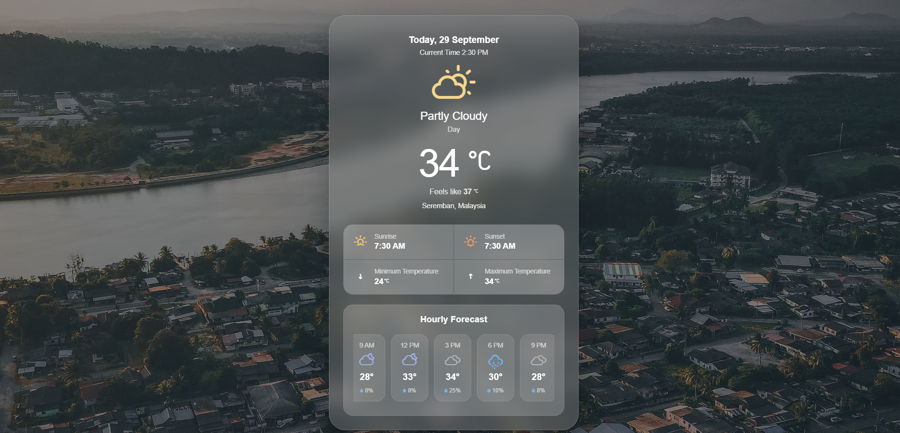

# WeatherAPI
A personal weather web application built with **Python, Flask, JavaScript, HTML, and CSS**, using the **Open-Meteo API** to retrieve weather data.

This project is being developed as a personal learning project to practise working with APIs, backend development, frontend JavaScript, and building a responsive web interface.

## Screenshot



## Features

### Current Weather

The application currently displays:

- Current temperature
- Feels-like / apparent temperature
- Weather condition
- Day / night status
- Current date
- Current time
- Location

Weather conditions are determined using the **WMO weather codes** provided by Open-Meteo.

### Weather Details

The application also retrieves and displays:

- Sunrise time
- Sunset time
- Today's minimum temperature
- Today's maximum temperature

### Hourly Forecast

The application displays a **24-hour hourly forecast** using weather data retrieved from Open-Meteo.

The hourly forecast includes:

- Time
- Temperature
- Precipitation probability
- Weather condition icon

The forecast is displayed at three-hour intervals, covering:

- 12 AM
- 3 AM
- 6 AM
- 9 AM
- 12 PM
- 3 PM
- 6 PM
- 9 PM
- 12 AM

### Weather Icons

Weather icons are dynamically selected based on the weather code.

For example:

- ☀️ Clear sky
- 🌤️ Mainly clear
- ⛅ Partly cloudy
- ☁️ Overcast
- 🌧️ Rain
- ⛈️ Thunderstorm
- 🌫️ Fog
- ❄️ Snow 

The day/night state is also taken into account when displaying appropriate icons.

---

## Technologies Used

### Backend

- **Python**
- **Flask**
- **Open-Meteo API**
- `openmeteo_requests`
- `requests_cache`
- `retry_requests`
- `pandas`

### Frontend

- **HTML5**
- **CSS3**
- **JavaScript**
- **Weather Icons by Erik Flowers**


### Development Tools

- Git
- GitHub
- VS Code

---

## API

This project uses the [Open-Meteo API](https://open-meteo.com/) to retrieve weather information.

The API provides:

- Current weather
- Hourly forecasts
- Daily forecasts
- Temperature
- Apparent temperature
- Rain / precipitation
- Humidity
- Sunrise and sunset
- Weather codes

The application uses the following Open-Meteo concepts:

```text
current
hourly
daily

```

## Future Improvements

Possible future improvements include:

- Add humidity information to the weather interface
- Add wind speed and wind direction
- Add a location search feature
- Allow users to search for weather in different cities
- Add automatic location detection
- Improve API error handling
- Add loading and error states to the interface
- Add more detailed weather forecasts
- Improve mobile and responsive design
- Add weather animations and visual effects
- Add a dark/light theme option
- Improve accessibility
- Optimise API requests and caching
- Deploy the application
